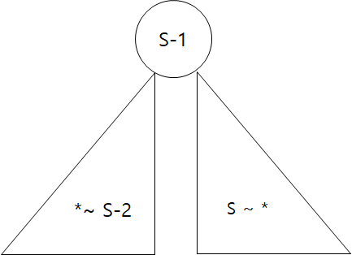

# Week1. UCPC 2016 본선

## A
**Algorithm** : `Splay Tree`

`splay tree`는 두 가지 연산을 이용해 작동하는데 특정 노드를 자신의 부모 위치로 옮기는 `rotate`와 특정 노드를 루트 노드로 옮기는 `splay`가 있다. 구조체는 `왼쪽 노드`, `오른쪽 노드`, `부모 노드`, `key값`으로 구성된다.

처음에는 단순하게 swaping하는 방법을 시도하였지만 시간초과가 발생하여 위의 알고리즘을 이용해 다시 구현해본다. 레드 블랙 트리에 버금가는 속도를 갖고 있기 때문에 STL을 못 쓰는 환경에서 유용하게 쓸 수 있다.

참고 : https://justicehui.github.io/hard-algorithm/2019/10/23/SplayTree4/

## B
**Algorithm** : 라인스위핑, 우선순위 큐.
클리크란, `완전 부분 그래프`를 의미한다. 즉, 정점으로 이루어진 집합 중 모든 두 정점 사이에 간선이 있는 집합을 의미한다.

시작은 단순하게 정점의 시작과 끝 점을 가지고 간선을 구했었지만 시간초과가 나서 다른 방법을 써야 했다. 인터넷을 통해 적합한 알고리즘을 찾았지만 이해하기 어려워서 도움을 요청한다.

## C
**Algorithm** : BFS, DFS, 

