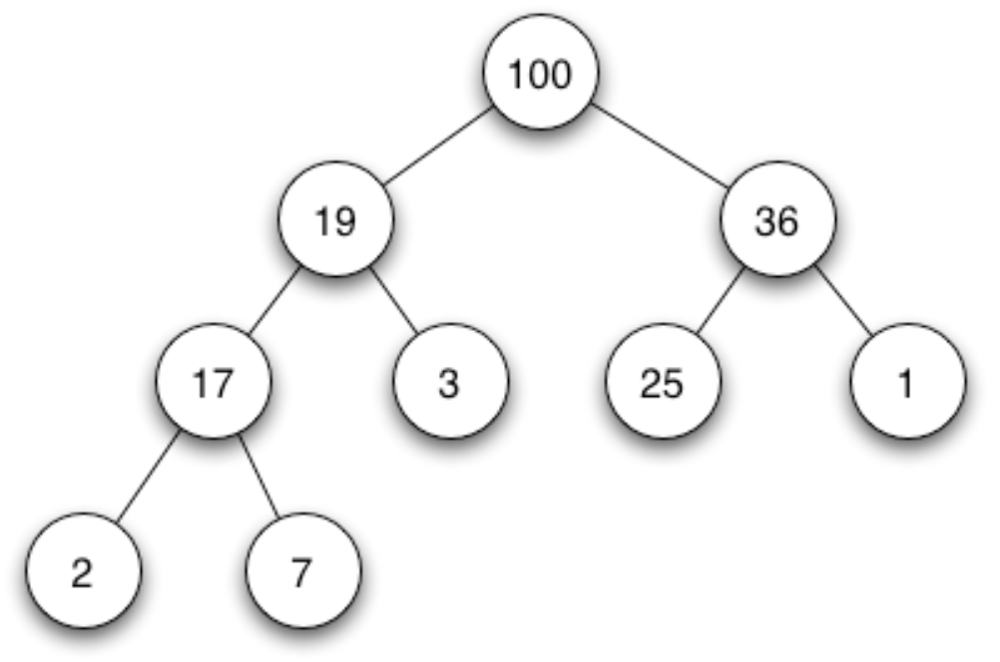

# Priority_Queue

우선순위큐는 우선순위가 가장 높은 것부터 나오는 자료구조 이다. LinkedList나 Array를 이용해 구현할 수도 있지만 보통 `heap`이라는 트리를 이용하여 구현하는 것이 가장 효율적이다.

> <h3><strong>What is Heap?</string></h3>
> 
> `힙(heap)`은 `힙트리(heap tree)`라고도 부르는데, 힙은 항상 *완전 이진 트리(Complete binary tree)* 형태를 띄어야 한다. 완전 이진 트리는 두 가지 조건이 있다.
> 1. 마지막 레벨을 제외한 모든 레벨에 노드가 꽉 차있어야 한다.(Complete tree)
> 2. 마지막 레벨의 노드는 왼쪽부터 순서대로 채워져야 한다.
 위 사진은 Max heap tree를 나타낸 것이다.

## 노드의 구조
힙의 노드는 `root node`부터 `leaf node`, `left`, `right`로 번호를 매기여 연속적인 번호를 가진다. 

## 노드의 표현
Array A에서 A[i]에 대응되는 노드들을 알아보자
* `parent` A[i/2]
* `left` A[2*i]
* `right` A[2*i+1]

## Heap Operation
힙과 관련된 연산은 여러가지가 있지만 그 중 노드를 추가하는 `push`, 최대값을 꺼내는 `pop`연산이 많이 쓰인다.

### `push`연산
새 노드를 `heap[]`의 마지막에 추가하고 자신의 `parent`와 크기를 비교한 뒤 `swap`하며 자리를 정한다.
```cpp
void push(int data){
    heap[++heap_count] = data;

    int child = heap_count;
    int parent = child/2;
    while(child > 1 && heap[parent]<heap[child]>){
        swap(&heap[parent] < heap[child]);
        child = parent;
        parent = child/2;
    }
}
```

### `pop`연산
`root node`가 빠져나오기 때문에 CBT를 유지하기 위해선 `마지막 node`가 `root node`로 올라와야 한다. 마지막 노드가 루트 노드로 올라온 뒤 자식들과 크기를 비교하며 자식이 없거나 자식이 자신보다 모두 작을 때 까지 내려간다. 이 때 자식들과 swap을 해야 한다면 Max heap 기준으로 둘 중 더 큰 값과 swap 해야한다.
```cpp
int pop(){
    int result = heap[1];
    swap(&heap[1], &heap[heap_count]);
    heap_count--;

    int parent = 1;
    int child = parent*2;
    if(child + 1 <= heap_count>){
        child = (heap[child]>heap[child+1]) ? child : child+1;
    }

    while(child <= heap_count && heap[parent] < heap[child]>){
        swap(&heap[parent],&heap[child]);
        parent = child;
        chile = parent*2;
        if(child + 1 <= heap_count){
            chile = heap[child] > heap[child+1] ? child : child+1;
        }
    }
return result;
}
```

## Min Heap & Max Heap
`Min Heap`은 root node가 최소값을 갖는 힙이고 `Max Heap`은 root node가 최대값을 가지는 힙이다.